## 你好，我是 Chikage

我主要写 Rust，折腾 Linux/NixOS，也喜欢做一些能提升开发效率的工具和自动化。

如果想合作/交流，最直接的方式是在你感兴趣的仓库里开个 issue。

- GitHub: https://github.com/Chikage0o0
- 方向: AI、自动化、系统编程、跨平台工具链、DevContainer
- 常用技术: Rust、Nix、JavaScript/Node.js、Python、Docker

### 代表项目

| 项目                                                               | 简介                                                   | 技术       |
| ------------------------------------------------------------------ | ------------------------------------------------------ | ---------- |
| [Anime-Repository](https://github.com/Chikage0o0/Anime-Repository) | 优雅的智能爬虫                                         | Rust       |
| [opencode](https://github.com/Chikage0o0/opencode)                 | OpenCode AI 助手配置 + MCP 集成                        | JavaScript |
| [nixos-config](https://github.com/Chikage0o0/nixos-config)         | 个人 NixOS & Home Manager Flake 配置                   | Nix        |
| [onelist](https://github.com/Chikage0o0/onelist)                   | OneDrive 文件列表服务                                  | Rust       |
| [DevContainer](https://github.com/Chikage0o0/DevContainer)         | 自用 Rust DevContainer 模板                            | Dockerfile |

### 工具箱

  
统计卡片

  

    
    
    
  

